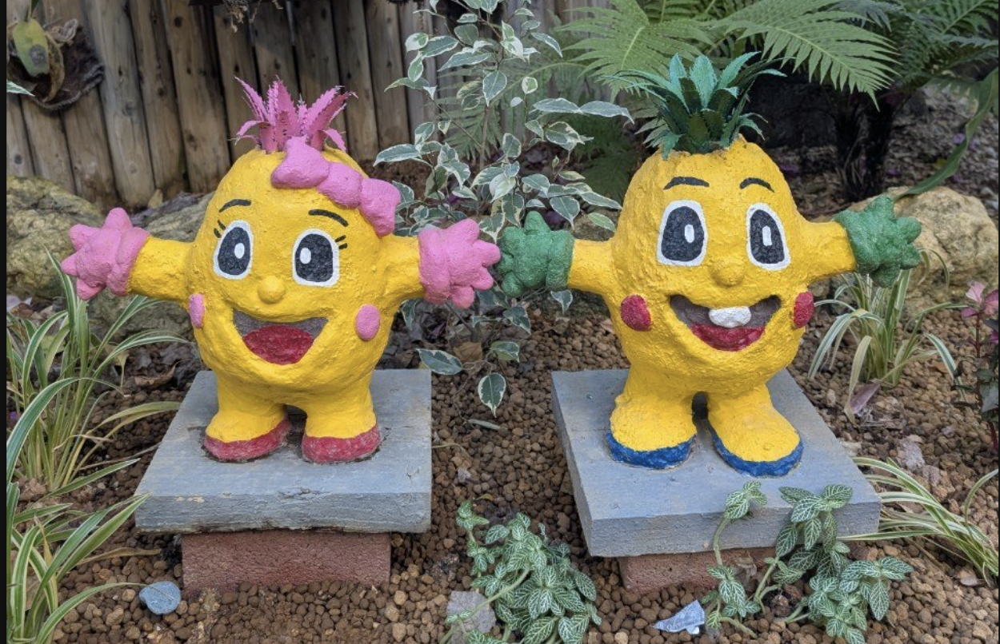
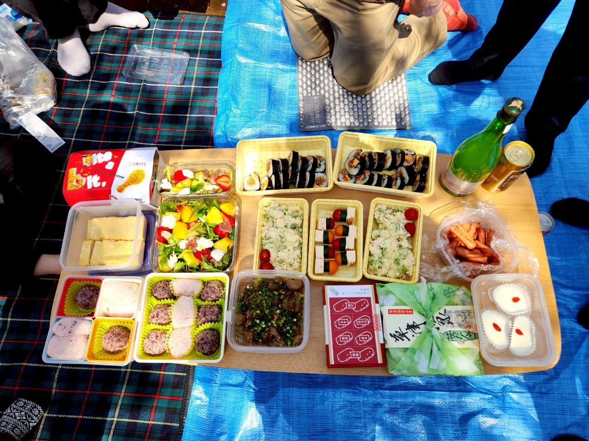
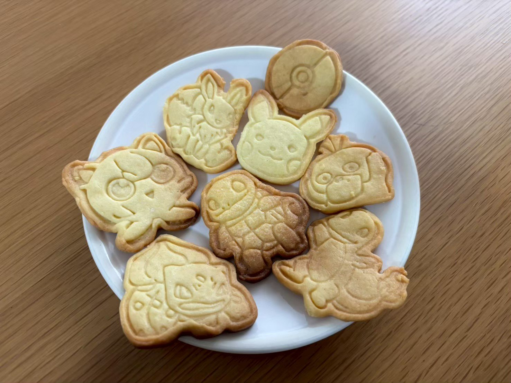
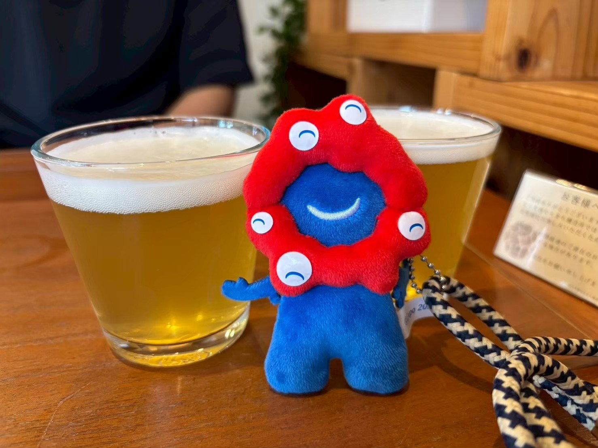
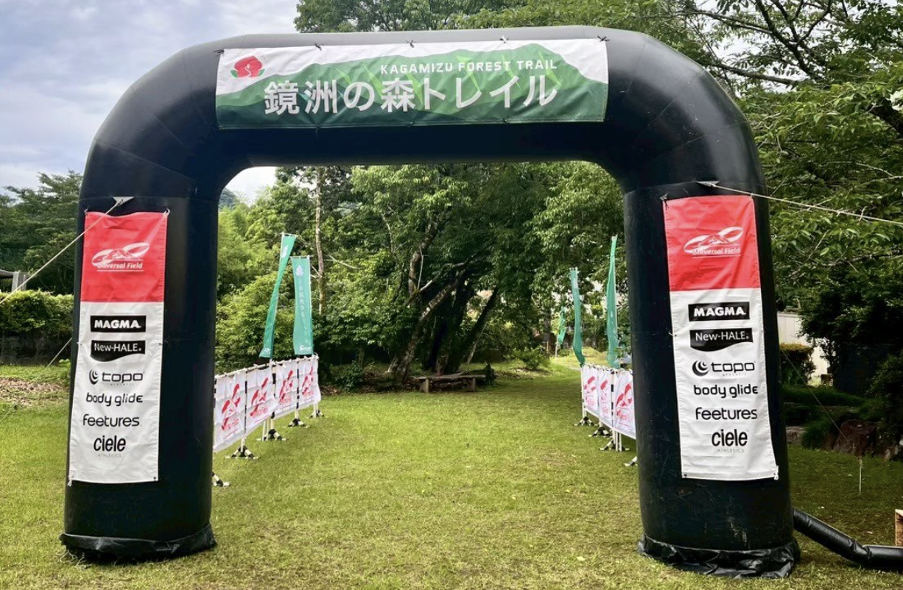
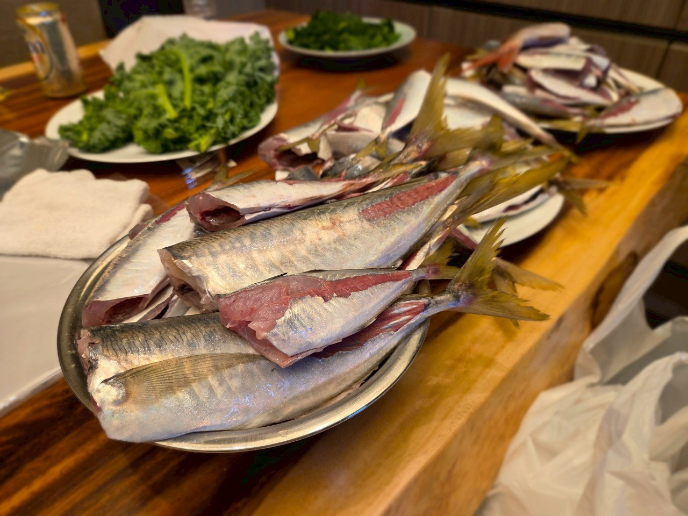
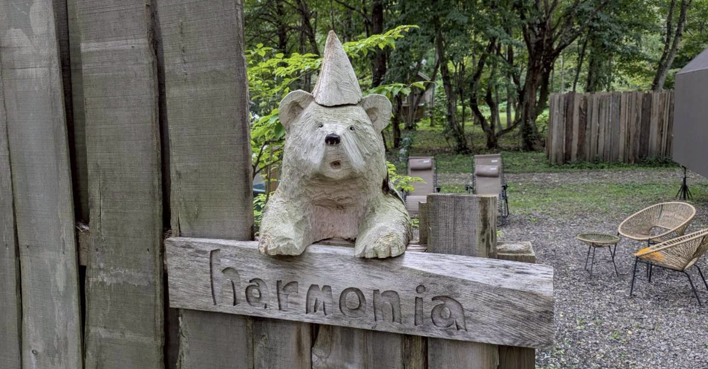
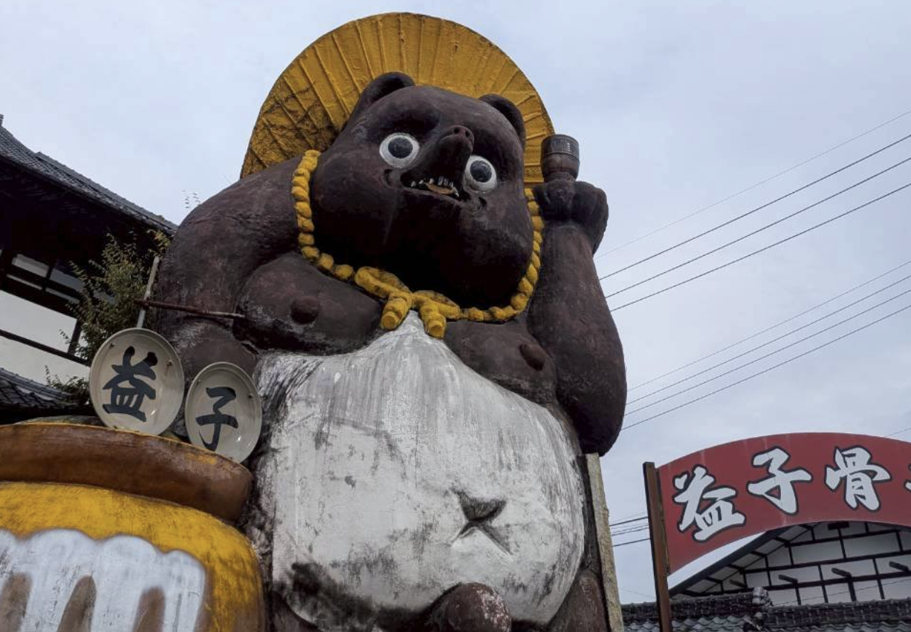

## はじめに

時の流れは早いもので2025年も終わりに近づいてきました。
今年は仕事に復帰したり、University of London(UoL)に入学したり、結婚したりと、多くの変化と挑戦の年となりました。

## 1月

今年の年越しは友人と沖縄旅行でした。
薄いカーディガン羽織るくらいの暖かさで、快適に過ごせました。
冬は沖縄に移住したくなりました。

そして3ヶ月を休職を終えて復職しました。
久しぶりの週5勤務の大変さを感じつつも、思っていたよりもスムーズに仕事に戻ることができました。
これまでと変わらずに接してくれた上司や同僚には感謝しています。

## 2月

あまり記憶がない...
そういえば人生で初めて確定申告をしました。
なんか適切にできているのか不安でしたが、思ってたよりサクッとできました。
経費とかちゃんと管理してなかったので、来年はもう少しちゃんとやろうと思います。(もう遅い)

## 3月

3月は彼女(現妻)の誕生日会を友人たちが企画してくれてお祝いしました。
15人くらい集まってくれて、とても愛されているなと感じました。
また、家の近くの桜がとても綺麗でお花見もできて良い思い出になりました。花より団子。

ホワイトデーはポケモンのクッキーを作りました。

そして人生初のワーケーション(in 草津)もしました。
仕事はしつつも、温泉に入ったり、美味しいご飯を食べたりとリフレッシュできました。

## 4月

4月からUniversity of LondonのBSc Computer Scienceプログラムに入学しました。
仕事に副業に学業の3足のわらじ生活が始まり、ここからは基本的に忙殺される日々が続きます。
そんな中でも懸賞で当たった北海道旅行や大阪万博に行ったりと、かなりアクティブに過ごしました。
大阪万博は意味不明なチケット購入方法に苦しめられ、お目当てのパビリオンには入れませんでしたが、無料ゾーンだけでも十分に楽しめました。もう一度行きたかったな〜

## 5月

5月は人生初のトレイルランニングの大会に参加しました。
宮崎の鏡洲トレイルで、約25kmのコースを走りました。
去年マラソンは走りましたが、トレランは初めてでヘロヘロになりながらも完走できてよかったです。
後から聞いたところ、結構過酷なコースだったようで、完走できたのは自信になりました。
また参加したいなと思いました。

## 6月

6月は付き合って2周年記念でディズニー旅行に行きました。
奮発してミラコスタに宿泊したのですが、まさかの幸運で部屋がスイートにアップグレードされて、最高の思い出になりました。(そしてプロポーズも成功)
[イル・マニーフィコ・スイート](https://www.tokyodisneyresort.jp/hotel/dhm/room/detail/suite_porto_ilmagnifico/)というミラコスタで最高級の部屋だったみたいで、存分に持て余しながらも満喫しました。

また友人たちと毎年恒例のアジ釣り旅行にも行きました。
山のように釣れるアジを3時間くらいひたすら捌くのが風物詩となっています。

学業では初めての中間テストがありました。
まだ初級の講義なので、なんとか乗り切れましたが、これから難しくなっていく不安でガクブルです。

## 7月

実は前々から地方移住したい欲があり、7月に福岡の朝倉市に[お試し移住](https://smout.jp/plans/5626)をしました。お試し移住とは、一定期間その土地に住んでみて、実際の生活を体験できる制度で、自分たちでレンタカーだけ用意すれば住居や光熱費などは全て無料で提供してもらえるありがたい制度です。
本来はここで2週間過ごす予定でしたが、大きな蜘蛛が出たり何故か咳や鼻水が止まらなくなったりとトラブル続きで、結局3日間で断念して帰宅しました。いざ住んでみて田舎の大変さや不便さも実感できたので、良い経験になりました。

あとは結婚式場の見学にも行きました。
[ホテル椿山荘東京](https://hotel-chinzanso-tokyo.jp/stay/?utm_source=google&utm_medium=cpc&utm_campaign=shukuhaku&gad_source=1&gad_campaignid=743923113&gbraid=0AAAAADN1OEAFrOfeAbL92AjjwIhwRGBVt&gclid=Cj0KCQiAx8PKBhD1ARIsAKsmGbfkAhT7Y4FQgGQJ5mQ-s2V6LhD1vP61fRUf1h9o_Y7n8DSKdHrxAuMaAgR3EALw_wcB#argument=pFurjW5m&ai=a61a61bfabb21f)と[アーヴェリール迎賓館 大宮](https://www.tgn.co.jp/wedding/omiya/avo/)の2箇所を見学しましたが、どちらも素敵で迷った結果、椿山荘に決めました。とても良かったので是非おすすめです。
画像は椿山荘のブライダルフェアで試食した料理でとても美味しかったです。

## 8月

8月は会社肝いりのプロジェクト対応で、約1ヶ月間レンタルオフィスに毎日出社し忙しく働きました。
普段はリモートワーク中心なので、久しぶりの毎日出社は新鮮でしたが、通勤電車はやはり疲れました。毎日通勤している人は本当に偉いなと改めて感じました。
あとは婚約/結婚指輪を買ったり、昔住んでたシェアハウスの3周年パーティがあったり、高円寺の阿波おどりを見に行ったりしました。

## 9月

9月も引き続き仕事が忙しい中、UoLの期末試験も重なりもうだめかと思いましたが、有給を駆使してなんとか乗り切りました。
そしてどきどきの両家顔合わせも行いました。
お互いの両親が初対面で緊張しましたが、和やかな雰囲気で進み、無事に終えることができました。

## 10月

UoLの期末試験を終えて、[THE SAUNA](https://lampinc.co.jp/nojiriko/sauna/)に行きました。プライベートな空間でゆったりとサウナを楽しむことができ、とてもリフレッシュできました。

また、結婚式の準備も本格化し、ドレス選びや招待状の作成など忙しくも楽しい時間を過ごしました。

## 11月

益子の陶器市に行きました。
想像を遥かに超える規模で、多くの陶器店が軒を連ねており、1日では見切れないほどでした。
お気に入りの丼も見つかり、日常使いに重宝しています。
画像は陶器市のマスコットキャラクター？のちょっと怖いたぬきです。
半年に一度開催されるようなので、おそらく来年も行きます。

そして結婚式の準備が襲いかかってきました。
我々の方針として自分たちでできることはなるべく自分たちでやって節約しようということで、招待状のデザインから印刷、席次表の作成、ムービー作成など、かなりの部分を自分たちで手作りしました。大変でしたが、その分思い入れも強くなり、良い思い出になりました。

## 12月

12月はついに結婚式本番でした。
天候も耐え、準備してきたイベントも大成功で、最高の一日となりました。
多くの友人や家族に祝福され、感謝の気持ちでいっぱいです。
披露宴で行った「笑顔写真コンテンスト」の詳細については以下の記事にまとめましたので、ぜひご覧ください。
[【GCP×LINE Bot】結婚式で「笑顔写真コンテスト」アプリを自作したら50人から150枚の写真が集まった](https://zenn.dev/r0nr0n/articles/wedding-smile-photo-contest)

## 総括

書きながら思いましたが、2025年は色んなことにチャレンジした激動の年でした。
仕事、学業、プライベートの全てで大きな変化があり、多忙ながらも充実した日々を過ごせました。
特に結婚は人生の大きな節目であり、改めて自分が結婚したんだなと実感しています。
年末年始は久しぶりにのんびりできるので、寝正月を楽しみたいと思います。
来年も今年のような充実した一年にできるよう、引き続き頑張っていきたいと思いました。
皆様、良いお年をお迎えください。
